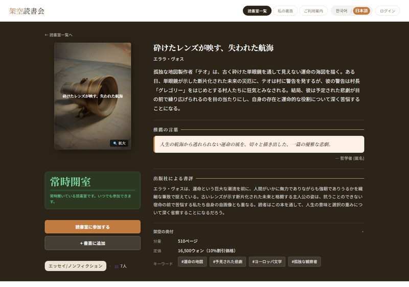
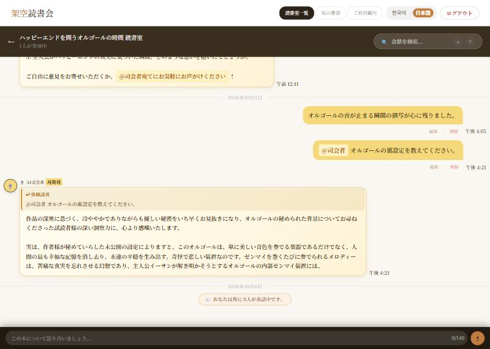

# 📚 架空読書会 / 가공독서회

> **存在しない本をAIが書き、読者が「読んだつもり」で語り合う読書会です。**
> **세상에 없는 책을 AI가 만들고, 독자들이 그 책을 읽은 척 감상을 나누는 독서 모임입니다.**

[](https://github.com/KIMTAEYEON0116/-Gakongbooks-/actions/workflows/tests.yml)

🌐 **Demo** http://43.200.22.235 ・ 🗣 **日本語 / 한국어** 対応

> 体験アカウント **test@example.com / test1234** — ログイン画面のボタンから、登録せずにそのままお試しいただけます。
> 체험 계정 **test@example.com / test1234** — 로그인 화면의 버튼으로 가입 없이 바로 둘러볼 수 있습니다.

**[日本語 →](#-日本語)** ・ **[한국어 →](#-한국어)**

| | |
|---|---|
|  |  |
| 読書室一覧 — AIが生成した本が並ぶ | 書籍詳細 — あらすじ・推薦文・討論テーマ |
|  |  |
| 読書室 — `@司会者` を呼ぶとAIが答える | アーカイブ — 終了した部屋が一冊の本になる |


---

# 🇯🇵 日本語

## 概要

「読んでいない本について語る」という設定の上に作ったサービスです。Gemini APIがタイトル・著者・あらすじ・推薦文・討論テーマまで備えた架空の本を生成すると、その本で **10日間の読書室** が開きます。読者はあらすじだけを読んで想像で感想を書き、`@司会者` を呼べばAIが議論を引き取ります。10日が過ぎると部屋は閉じ、会話はまるごと **アーカイブ** に残ります。

```
AIが本を作る → 読書室が開く(10日) → 想像で語り合う → アーカイブに残る
```

個人開発（1人）。企画・デザイン・フロントエンド・バックエンド・デプロイまで担当しました。

## 主な機能

| 機能 | 内容 |
|---|---|
| **AI書籍生成** | Gemini APIが3冊の候補を生成し、選んだ1冊で読書室が開く（1日1回）。表紙はPillowで合成し、API失敗時はテンプレートで代替 |
| **AI司会者** | 入室時の歓迎カードで討論テーマを3つ提示。`@司会者` へのメンションに応答（5分に3回まで）。締切時には総括を残す |
| **読書室の自動運用** | 作成日を基準に10日で締切。締切後は会話をアーカイブへ移し、進行中の本が3冊を下回れば自動で補充 |
| **会話** | 返信・編集・削除・リアクション（4種）・会話内検索 |
| **アーカイブ** | 終了した読書室を雑誌のように読む閲覧画面と、月別の本棚 |
| **マイ本棚** | 気に入った本を表紙のまま棚に並べて保管 |
| **多言語** | 画面文言348項目とすべての書籍・会話データを日韓2言語で保持 |

## 技術スタック

| 区分 | 使用技術 |
|---|---|
| Frontend | HTML, CSS, JavaScript（フレームワークなし）, Jinja2 |
| Backend | Python 3.12, FastAPI, SQLAlchemy, Uvicorn |
| Database | MySQL 8.0（本番） / SQLite（開発） |
| AI・画像 | Google Gemini API, Pillow |
| Infra | AWS EC2 (Ubuntu 24.04), Nginx, systemd |
| 認証 | JWT, bcrypt, SMTP（パスワード再設定メール） |

## セットアップ

```bash
# 1. 設定ファイル
cp .env.example .env     # DATABASE_URL / JWT_SECRET_KEY / GEMINI_API_KEY などを記入

# 2. 依存関係
pip install -r requirements.txt

# 3. 起動
uvicorn main:app --reload --port 8001
```

`.env` の主な項目です。`APP_ENV=production` では必須の値が欠けているとサーバーが起動しません。

| 変数 | 説明 |
|---|---|
| `APP_ENV` | `development` / `production` |
| `DATABASE_URL` | 未設定ならSQLiteにフォールバック（本番では不可） |
| `JWT_SECRET_KEY` | `python -c "import secrets; print(secrets.token_urlsafe(48))"` |
| `OWNER_ADMIN_EMAIL` | 運営者アカウント。起動時にこの1つだけへ管理者権限を付与 |
| `GEMINI_API_KEY` | 無料枠は1日20回。超過時はテンプレートで代替 |
| `GEMINI_MODEL` | 既定は `gemini-3.8-flash` |
| `SMTP_*` | パスワード再設定メールの送信用 |


## 設計で悩んだこと

実装より判断に時間がかかった箇所を残します。

### 日本語を「翻訳」ではなく「生成」で得る

当初は韓国語で本を作り、あとから日本語へ翻訳していました。これには二つの問題がありました。翻訳が終わるまで日本語画面に韓国語が見えること、そして出来上がる日本語が翻訳調になることです。

日本語ページなら最初から日本語で書かれた文章であるべきだと考え、書籍生成のJSONに `ja` ブロックを同梱しました。API呼び出しは一度のままで、韓国語を経由しません。モデルが `ja` を落とした場合だけ、従来の翻訳経路が補います。

### 翻訳の検証を「全体」から「項目」単位へ

訳文に韓国語が残る、区切り記号が壊れるといった失敗は実際に起きます。当初は一つでも問題があれば訳文全体を破棄していました。ところが12項目中2項目で毎回つまずく本は、何度試しても永久に翻訳されません。

検証を項目単位に変え、通った項目だけ保存して既存の訳文へマージするようにしました。残りは補充ループが次の周回で再挑戦します。試すほど訳文が積み上がります。

### モデル連鎖に時間予算を置く

無料枠のGemini APIは503を返すことが珍しくありません。6つの代替モデルを順に試す構成にしたところ、全てが遅く失敗した日には待ち時間がそのまま積み上がり、Nginxの90秒制限に達して504だけがユーザーへ届きました。

連鎖全体に時間予算を設けました。ただし予算は「人が待っている」から必要なもので、背後で走る翻訳には待つ人がいません。呼び出し側が予算を決める形にし、リクエスト経路は45秒、バックグラウンドは240秒としています。

### 応答文の言語をContextVarで持つ

サーバーが返す案内文も画面と同じ言語であるべきです。画面が送る `X-App-Lang` ヘッダをミドルウェアがContextVarへ入れ、`m(韓国語, 日本語)` で選びます。

認証エラーだけは最初うまくいきませんでした。例外をモジュール読み込み時に一度作って使い回していたため、文言が韓国語で固定されていたのです。言語選択を `i18n.py` に切り出して `auth.py` からも使えるようにし、例外はリクエストごとに作るよう直しました。

### ワーカーを1つに固定する

レート制限とバックグラウンド処理をプロセス内で持っているため、ワーカーを増やすと制限が人数分に緩み、定期処理が重複します。個人開発の規模では分散させる利点より事故の可能性が上回ると判断し、`--workers 1` を明示しています。

## テスト

実際に起きた不具合の再現テストです。メモリ上のSQLiteで動くため、実データには触れません。

```bash
python tests/test_adopt_owner.py     # 他人の候補書籍を横取りできないこと
python tests/test_reply_cascade.py   # 元の投稿を消しても他人の返信が消えないこと
```

## セキュリティ設計

- パスワードは **bcrypt**（1件ごとに異なるソルト）で保存
- パスワード変更時に、それ以前に発行された **JWTを無効化**
- 再設定トークンは **ハッシュのみ保存・1回限り・有効期限つき**
- ログイン・新規登録・再設定・司会者呼び出しに **回数制限**
- **CSP** をはじめとするセキュリティヘッダーを付与
- 本番では **必須シークレットが欠けると起動を中断**、API文書（`/docs`）も非公開
- チャットの編集・削除、評価、本棚は **本人のみ** 操作可能


## 運用

| 項目 | 内容 |
|---|---|
| バックアップ | 毎日04:00にmysqldumpを取得し、14日分を保持（`scripts/backup_db.sh`、cron） |
| スキーマ更新 | モデルにあってテーブルに無い列は起動時に自動追加（`_SCHEMA_PATCHES`） |
| 翻訳の補充 | 訳が欠けた本を30分ごとに1件ずつ再試行。連続失敗で間隔を広げ、1日12回を上限とする |
| 依存関係 | 本番と同じバージョンに固定。CIも同じ環境でテストする |
| 死活監視 | `/health` がアプリとDBの状態を返す。外部監視サービスからの確認用 |
| 体験アカウント | 複数の閲覧者が同じ日に使うため、「1日1回」ではなく180分のクールダウンで生成を制限 |

## デプロイ構成

```
インターネット → Nginx(80) → Uvicorn(127.0.0.1:8000, worker 1) → MySQL(127.0.0.1:3306)
```

アプリは外部に直接公開せず、Nginxだけが前に立ちます。systemdで管理しているため再起動後も自動で立ち上がります。バックグラウンド処理と回数制限がプロセス内で動くため、ワーカーは **1つ固定** です。

```bash
# 更新の反映
cd ~/-Gakongbooks- && git pull && sudo systemctl restart gakongbooks
```

## プロジェクト構成

```text
├── main.py             # APIエンドポイント・Gemini連携・バックグラウンド処理
├── config.py           # 環境変数の単一窓口（本番では必須値を検証）
├── auth.py             # ハッシュ化・JWT・再設定トークン・管理者権限
├── security.py         # 回数制限・セキュリティヘッダー・クライアントIP判定
├── models.py           # テーブル定義（7テーブル）
├── database.py         # 接続とセッション
├── templates/          # Jinja2テンプレート（ページ・共通パーツ）
├── static/             # CSS・JavaScript・表紙画像
├── scripts/            # 翻訳の書き出し/復元・翻訳検査・データ復元
├── tests/              # 不具合の再現テスト
└── data/               # 日本語訳とデータのバックアップ
```

---

# 🇰🇷 한국어

## 개요

"읽지 않은 책에 대해 이야기한다"는 설정 위에 세운 서비스입니다. Gemini API가 제목, 작가, 줄거리, 추천사, 토론 질문까지 갖춘 가상의 책을 만들면 그 책으로 **10일짜리 독서방**이 열립니다. 독자는 줄거리만 읽고 상상으로 감상을 남기고, `@사회자`를 부르면 AI가 토론을 이어받습니다. 10일이 지나면 방은 닫히고 대화 전체가 **아카이브**에 남습니다.

```
AI가 책을 만든다 → 독서방이 열린다(10일) → 상상으로 감상을 나눈다 → 아카이브에 남는다
```

개인 프로젝트(1인)이며 기획, 디자인, 프론트엔드, 백엔드, 배포까지 맡았습니다.

## 주요 기능

| 기능 | 내용 |
|---|---|
| **AI 도서 생성** | Gemini API가 후보 3권을 만들고 그중 하나로 독서방을 엽니다(하루 1회). 표지는 Pillow로 합성하고, API 실패 시 템플릿으로 대체합니다 |
| **AI 사회자** | 입장 시 환영 카드로 토론 질문 3개를 제시합니다. `@사회자` 멘션에 답하고(5분 3회 제한), 마감 때 마무리 인사를 남깁니다 |
| **독서방 자동 운영** | 생성 날짜 기준 10일 마감. 마감 후 대화를 아카이브로 옮기고, 진행 중인 책이 3권 미만이면 자동으로 채웁니다 |
| **대화** | 답장, 수정, 삭제, 반응 4종, 대화 검색 |
| **아카이브** | 끝난 독서방을 잡지처럼 넘겨 보는 열람 화면과 월별 서가 |
| **내 서재** | 마음에 든 책을 표지 그대로 책장에 꽂아 보관 |
| **다국어** | 화면 문구 348개와 모든 도서·대화 데이터를 한국어·일본어로 보유 |

## 기술 스택

| 구분 | 사용 기술 |
|---|---|
| Frontend | HTML, CSS, JavaScript(프레임워크 없음), Jinja2 |
| Backend | Python 3.12, FastAPI, SQLAlchemy, Uvicorn |
| Database | MySQL 8.0(운영) / SQLite(개발) |
| AI·이미지 | Google Gemini API, Pillow |
| Infra | AWS EC2 (Ubuntu 24.04), Nginx, systemd |
| 인증 | JWT, bcrypt, SMTP(비밀번호 재설정 메일) |

## 실행 방법

```bash
# 1. 설정 파일
cp .env.example .env     # DATABASE_URL / JWT_SECRET_KEY / GEMINI_API_KEY 등을 채웁니다

# 2. 의존성 설치
pip install -r requirements.txt

# 3. 실행
uvicorn main:app --reload --port 8001
```

`.env`의 주요 항목입니다. `APP_ENV=production`에서는 필수값이 비어 있으면 서버가 기동되지 않습니다.

| 변수 | 설명 |
|---|---|
| `APP_ENV` | `development` / `production` |
| `DATABASE_URL` | 비우면 SQLite로 대체됩니다(운영에서는 불가) |
| `JWT_SECRET_KEY` | `python -c "import secrets; print(secrets.token_urlsafe(48))"` |
| `OWNER_ADMIN_EMAIL` | 운영자 계정. 기동 시 이 계정에만 관리자 권한을 부여합니다 |
| `GEMINI_API_KEY` | 무료 한도는 하루 20회. 초과 시 템플릿으로 대체합니다 |
| `GEMINI_MODEL` | 기본값은 `gemini-3.8-flash` |
| `SMTP_*` | 비밀번호 재설정 메일 발송용 |


## 설계하며 고민한 것

구현보다 판단에 시간이 걸린 부분을 남깁니다.

### 일본어를 '번역'이 아니라 '생성'으로 얻기

처음에는 한국어로 책을 만들고 나중에 일본어로 옮겼습니다. 두 가지 문제가 따라왔습니다. 번역이 끝나기 전까지 일본어 화면에 한국어가 보이는 것, 그리고 완성된 일본어가 번역투가 되는 것입니다.

일본어 페이지라면 처음부터 일본어로 쓰인 글이어야 한다고 보고, 책 생성 JSON에 `ja` 블록을 함께 받도록 했습니다. API 호출은 그대로 한 번이고 한국어를 거치지 않습니다. 모델이 `ja`를 빠뜨린 경우에만 기존 번역 경로가 메웁니다.

### 번역 검증을 '전체'에서 '항목' 단위로

번역문에 한국어가 남거나 구분 기호가 깨지는 실패는 실제로 일어납니다. 처음에는 하나라도 문제가 있으면 번역문 전체를 버렸습니다. 그런데 열두 항목 중 두 항목에서 매번 걸리는 책은 몇 번을 시도해도 영영 번역되지 않습니다.

검증을 항목 단위로 바꿔 통과한 것만 저장하고 기존 번역문에 병합합니다. 나머지는 되채우기 루프가 다음 바퀴에 다시 시도합니다. 시도할수록 번역이 쌓입니다.

### 모델 연쇄에 시간 예산 두기

무료 등급의 Gemini API는 503을 드물지 않게 돌려줍니다. 대체 모델 여섯 개를 차례로 시도하도록 만들었더니, 전부 느리게 실패한 날에는 대기 시간이 그대로 쌓여 Nginx의 90초 제한에 닿았고 사용자에게는 504만 갔습니다.

연쇄 전체에 시간 예산을 뒀습니다. 다만 예산은 '사람이 기다리기 때문에' 필요한 것이고, 뒤에서 도는 번역에는 기다리는 사람이 없습니다. 호출하는 쪽이 예산을 정하도록 바꿔 요청 경로는 45초, 백그라운드는 240초를 씁니다.

### 응답 문구의 언어를 ContextVar로 들고 다니기

서버가 돌려주는 안내문도 화면과 같은 언어여야 합니다. 화면이 보내는 `X-App-Lang` 헤더를 미들웨어가 ContextVar에 담고, `m(한국어, 일본어)`로 고릅니다.

인증 오류만 처음에 잘 안 됐습니다. 예외를 모듈 읽을 때 한 번 만들어 두고 돌려쓰고 있어서 문구가 한국어로 굳어 있었습니다. 언어 선택을 `i18n.py`로 떼어내 `auth.py`에서도 쓰게 하고, 예외는 요청마다 새로 만들도록 고쳤습니다.

### 워커를 하나로 고정하기

속도 제한과 백그라운드 처리를 프로세스 안에 두고 있어서, 워커를 늘리면 제한이 사람 수만큼 느슨해지고 정기 작업이 겹쳐 돕니다. 1인 개발 규모에서는 분산의 이득보다 사고 가능성이 크다고 보고 `--workers 1`을 명시했습니다.

## 테스트

실제로 발생했던 문제의 재현 테스트입니다. 메모리 SQLite에서 돌아가 실제 데이터를 건드리지 않습니다.

```bash
python tests/test_adopt_owner.py     # 남의 후보 도서를 가로챌 수 없는지
python tests/test_reply_cascade.py   # 원글을 지워도 남의 답글이 남는지
```

## 보안 설계

- 비밀번호는 **bcrypt**로 저장하며 건마다 다른 솔트를 씁니다
- 비밀번호를 바꾸면 그 이전에 발급된 **JWT를 무효화**합니다
- 재설정 토큰은 **해시만 저장하고 1회용이며 유효 기간**이 있습니다
- 로그인, 가입, 재설정, 사회자 호출에 **횟수 제한**을 둡니다
- **CSP**를 비롯한 보안 헤더를 부착합니다
- 운영에서는 **필수 시크릿이 없으면 기동을 중단**하고 API 문서(`/docs`)도 감춥니다
- 채팅 수정·삭제, 평점, 서재는 **본인만** 조작할 수 있습니다


## 운영

| 항목 | 내용 |
|---|---|
| 백업 | 매일 04:00에 mysqldump, 14일 보관 (`scripts/backup_db.sh`, cron) |
| 스키마 변경 | 모델에 있고 테이블에 없는 컬럼은 기동 시 자동 추가 (`_SCHEMA_PATCHES`) |
| 번역 되채우기 | 번역이 빠진 책을 30분마다 한 권씩 재시도. 연속 실패하면 간격을 벌리고 하루 12회로 제한 |
| 의존성 | 운영과 같은 버전으로 고정. CI도 같은 환경에서 테스트 |
| 상태 확인 | `/health` 가 앱·DB 상태를 돌려준다. 외부 모니터링 서비스 연결용 |
| 체험 계정 | 여러 열람자가 같은 날 쓰므로 '하루 1회' 대신 180분 쿨다운으로 생성 제한 |

## 배포 구성

```
인터넷 → Nginx(80) → Uvicorn(127.0.0.1:8000, 워커 1개) → MySQL(127.0.0.1:3306)
```

앱은 외부에 직접 노출하지 않고 Nginx만 앞에 둡니다. systemd로 관리해 재부팅 후에도 자동으로 실행됩니다. 백그라운드 작업과 횟수 제한이 프로세스 안에서 동작하므로 워커는 **1개로 고정**합니다.

```bash
# 변경 사항 반영
cd ~/-Gakongbooks- && git pull && sudo systemctl restart gakongbooks
```

## 프로젝트 구조

```text
├── main.py             # API 엔드포인트 · Gemini 연동 · 백그라운드 작업
├── config.py           # 환경변수 단일 진입점(운영에서 필수값 검증)
├── auth.py             # 해싱 · JWT · 재설정 토큰 · 관리자 권한
├── security.py         # 횟수 제한 · 보안 헤더 · 클라이언트 IP 판별
├── models.py           # 테이블 정의(7개)
├── database.py         # 연결과 세션
├── templates/          # Jinja2 템플릿(페이지 · 공통 요소)
├── static/             # CSS · JavaScript · 표지 이미지
├── scripts/            # 번역 내보내기/복원 · 번역 검사 · 데이터 복원
├── tests/              # 불량 재현 테스트
└── data/               # 일본어 번역본과 데이터 백업
```

---

<sub>본 사이트의 가상 도서 기본 정보는 AI 생성물이며 저작권 보호 대상이 아닙니다. 독자가 남긴 감상과 대화는 작성자 본인에게 저작권이 있습니다.</sub>
